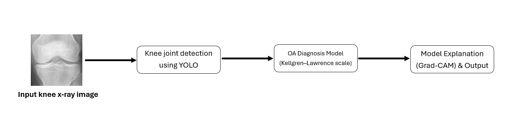
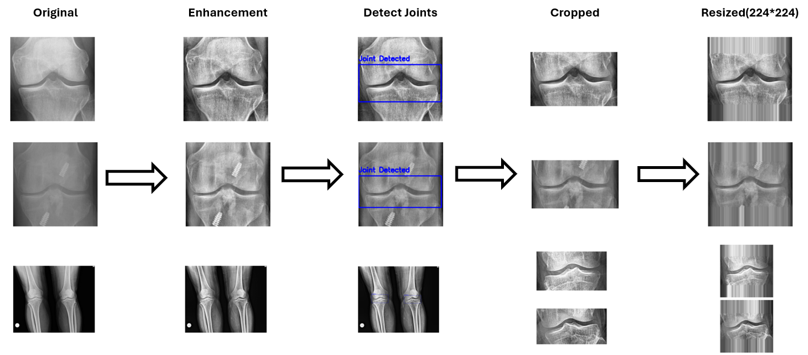
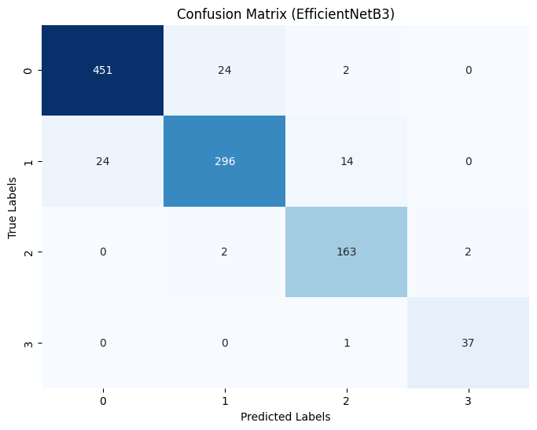
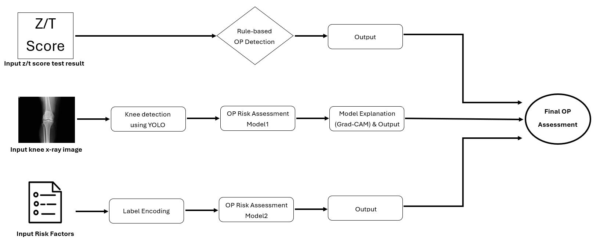
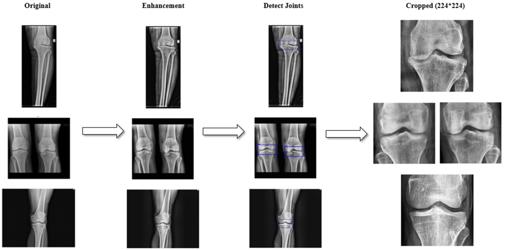
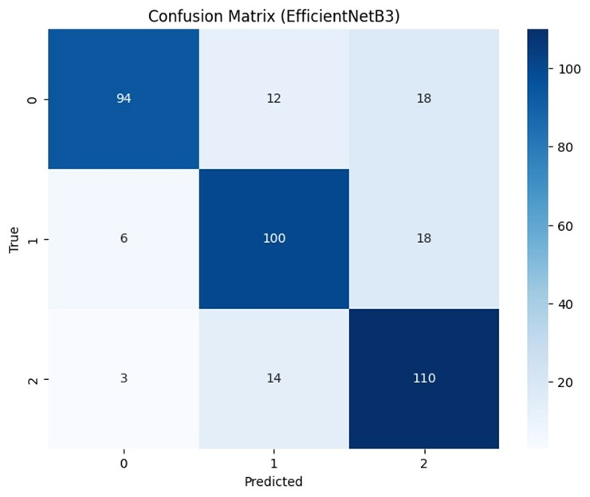
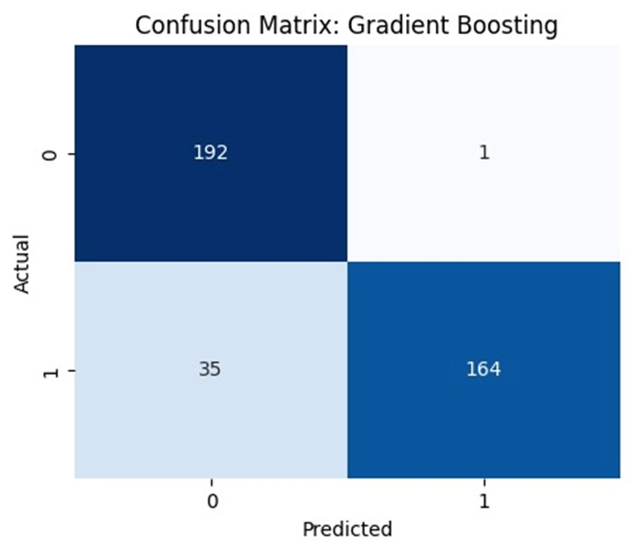
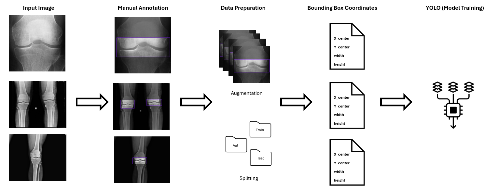

# Osteo-by-AI 🤖🦴🩻

> **End-to-end AI framework for Osteoarthritis and Osteoporosis diagnosis**

[](https://www.python.org/)
[](https://keras.io/)
[](https://github.com/ultralytics/ultralytics)
[](https://flask.palletsprojects.com/)
[]()

---

## 📖 Abstract

**Osteo by AI** is an intelligent, end-to-end diagnostic framework designed for automated detection of two major skeletal disorders: **Osteoarthritis (OA)** and **Osteoporosis (OP)**. The system integrates deep learning, ensemble modeling, and explainable AI (XAI) techniques into a single unified pipeline to support clinicians in medical decision-making.

A **YOLOv8-based helper model** is first used to precisely localize knee joint regions within X-ray images, ensuring all subsequent models operate on focused, anatomically consistent inputs. For OA, **transfer learning** (EfficientNet-B3, DenseNet121, ResNet50) is applied to classify disease severity according to the Kellgren–Lawrence grading system. For OP, a **multi-source ensemble model** fuses three complementary submodels — an imaging-based CNN, a clinical/lifestyle machine learning model, and a rule-based BMD classifier — into a unified dynamic decision framework.

Model interpretability is addressed through **Grad-CAM** (for imaging) and **SHAP** (for clinical data), providing visual and statistical explanations that build clinical trust. The system was developed and evaluated on publicly available datasets and deployed via a **Flask-based web interface** for real-time diagnostic support.

This project was developed as a graduation requirement for the **Data Science and Artificial Intelligence** program at **Al al-Bayt University, Jordan (August 2025)**, under the supervision of **Dr. Mazen Al-Zyoud**.

---

## 📑 Table of Contents

- [Background & Motivation](#background--motivation)
- [Objectives](#objectives)
- [Framework Overview](#framework-overview)
- [Osteoarthritis (OA) Module](#1️⃣-osteoarthritis-oa-module)
  - [Dataset](#-dataset)
  - [System Design](#-system-design)
  - [Preprocessing Steps](#-preprocessing-steps)
  - [Model Architecture](#-model-architecture)
  - [Results](#-results)
- [Front-End (OA)](#-front-end-oa-interface)
- [Osteoporosis (OP) Module](#2️⃣-osteoporosis-op-module)
  - [Datasets](#-datasets)
  - [System Design](#-system-design-1)
  - [Preprocessing Steps](#-preprocessing-steps-images)
  - [Model Architecture](#-model-architecture-1)
  - [Results](#-results-images-submodel)
- [Front-End (OP)](#-front-end-op-interface)
- [Helper Model — YOLOv8](#✨-helper-model--yolov8-for-joint-localization)
- [Explainable AI](#-explainable-ai-xai)
- [Tech Stack](#-tech-stack)
- [Authors](#-authors)

---

## 🩺 Background & Motivation

Musculoskeletal disorders — particularly those beginning with the prefix *"osteo-"* (from the Greek *osteon*, meaning "bone") — are among the most prevalent causes of chronic pain and disability worldwide.

- **Osteoarthritis (OA)** is the most common musculoskeletal disorder globally, ranked as the 11th leading cause of disability. It is a degenerative joint disease characterized by progressive cartilage breakdown, joint space narrowing, and osteophyte formation. The total cost of managing OA can reach up to €19,000 per patient per year.

- **Osteoporosis (OP)**, often called the "silent disease," is a progressive skeletal condition characterized by reduced bone mass and deteriorated microarchitecture, substantially increasing fracture risk — often without any symptoms until a fracture occurs.

Despite their medical importance, traditional diagnosis of both diseases remains resource-intensive:
- OA diagnosis via X-ray requires high clinical expertise to interpret subtle findings.
- OP diagnosis via DEXA (dual-energy X-ray absorptiometry) scans is expensive and not universally accessible.

This project addresses these gaps by developing an AI-based diagnostic system that combines radiographic imaging, clinical risk factors, and BMD results to deliver accurate, interpretable, and accessible diagnoses — particularly in resource-limited environments.

---

## 🎯 Objectives

- Develop a deep learning model for **OA severity grading** from knee X-ray images using the Kellgren–Lawrence (KL) classification system.
- Design a **flexible ensemble model for OP** that can accept any combination of: X-ray images, clinical/lifestyle tabular data, and/or BMD test scores — and still produce reliable predictions.
- Enable **early and low-cost screening** without requiring all input modalities simultaneously.
- Improve **model interpretability** using Grad-CAM and SHAP to make AI decisions clinically understandable.
- Deploy the system through a **web-based interface** for real-time clinical support.

---

## 🏗️ Framework Overview

```
Input X-ray Image
        │
        ▼
  ┌─────────────┐
  │  YOLOv8     │  ← Joint localization (knee ROI extraction)
  │ Helper Model│
  └──────┬──────┘
         │
   ┌─────┴──────┐
   ▼            ▼
┌──────┐    ┌──────────────────────────────────────────┐
│  OA  │    │                OP Ensemble               │
│ CNN  │    │  ┌──────────┐ ┌──────────┐ ┌──────────┐ │
│(KL   │    │  │ Imaging  │ │ Clinical │ │   BMD    │ │
│grade)│    │  │ CNN (30%)│ │ ML (20%) │ │ Rules    │ │
└──────┘    │  └──────────┘ └──────────┘ │ (50%)    │ │
   │        │                            └──────────┘ │
   │        │         Dynamic Weighted Fusion          │
   │        └──────────────────────────────────────────┘
   │                         │
   ▼                         ▼
Grad-CAM             Grad-CAM + SHAP
(XAI)                (XAI)
   │                         │
   └────────────┬────────────┘
                ▼
        Flask Web Interface
```

---

## 1️⃣ Osteoarthritis (OA) Module

### 📊 Dataset

The OA model was trained on the **"Knee Osteoarthritis Dataset with Severity Grading"**, sourced from the **Osteoarthritis Initiative (OAI)** and published on Mendeley Data (CC BY 4.0) by Shashwat et al. A mirrored copy is also available on Kaggle.

Images are labeled using the **Kellgren–Lawrence (KL) grading system**. Grade 1 (doubtful) was excluded due to its ambiguous visual characteristics. The final dataset comprises **8,016 X-ray images** across 4 classes:

| Class | KL Grade | Description | Images |
|-------|----------|-------------|--------|
| 0 | Grade 0 | Normal | 3,758 |
| 1 | Grade 2 | Mild OA | 2,578 |
| 2 | Grade 3 | Moderate OA | 1,286 |
| 3 | Grade 4 | Severe OA | 295 |

To address class imbalance, the training set was rebalanced to **1,900 samples per class** using augmentation techniques (horizontal flipping, contrast adjustment, Gaussian noise). The dataset was split 75% / 12.5% / 12.5% for training, validation, and testing.

### 📄 System Design



### 🪜 Preprocessing Steps

Image preprocessing for OA involved two key stages:

1. **CLAHE Enhancement**: Contrast Limited Adaptive Histogram Equalization was applied incrementally. Feature extraction using ORB confirmed that **3 consecutive CLAHE applications** yielded the optimal number of detectable features across all classes.

2. **YOLO-Assisted Cropping**: YOLOv8 (confidence threshold ≥ 0.65) was used to localize the knee joint region in each image. The extracted ROI was then resized to **224 × 224 pixels** using `cv2.BORDER_REPLICATE` to preserve edge integrity without distortion.

3. **Augmentation**: Training data was augmented with rotation (±20°), width/height shifts (±10%), shearing (±10%), zoom (±20%), and horizontal flipping.



### 🧠 Model Architecture

Three pretrained CNN architectures were fine-tuned using **transfer learning** on ImageNet weights and adapted for 4-class OA classification:

| Model | Description |
|-------|-------------|
| **ResNet50** | 50-layer residual network with skip connections to mitigate vanishing gradients |
| **DenseNet121** | 121-layer dense network with layer-to-layer reuse for efficient gradient flow |
| **EfficientNet-B3** | Compound-scaled CNN balancing depth, width, and resolution via neural architecture search |

Each model was trained over **30 epochs** across 4 phases with a progressively decaying learning rate schedule (5e-4 → 5e-6), using the Adam optimizer on the Kaggle platform.

### 🔎 Results



| Model | Accuracy | Notable Strength |
|-------|----------|-----------------|
| ResNet50 | 89% | Strong detection of severe cases (Class 3 recall: 0.92) |
| DenseNet121 | 91% | Improved early/mid-stage detection |
| **EfficientNet-B3** | **93%** | Best overall — Class 2 recall of 0.98 |

> ✅ **Best Model: EfficientNet-B3** — Accuracy = **0.93**

EfficientNet-B3 achieved the best balance between precision and recall across all severity classes, making it the selected backbone for the OA diagnostic pipeline.

---

## 🪞 Front-End (OA Interface)

The OA diagnostic interface was built using **HTML, CSS, and JavaScript** for the frontend, integrated with a **Flask** backend that connects directly to the trained Python model pipelines. User-uploaded X-ray images are passed through the full preprocessing and inference pipeline — including CLAHE enhancement, YOLO-based joint localization, and EfficientNet-B3 classification — and the predicted KL grade along with its Grad-CAM heatmap are returned and rendered in the browser in real time.


---

## 2️⃣ Osteoporosis (OP) Module

### 📊 Datasets

The OP module integrates three distinct data sources:

**Imaging Data (Knee X-rays):** Two public Kaggle datasets were merged:

| Class | Dataset 1 | Dataset 2 | Total |
|-------|-----------|-----------|-------|
| Normal | 780 | 36 | 816 |
| Osteopenia | 374 | 154 | 528 |
| Osteoporosis | 793 | 49 | 842 |
| **Total** | 1,947 | 239 | **2,186** |

After YOLO-based preprocessing (splitting bilateral knee images into independent samples), the final image counts increased to: Normal (828), Osteopenia (824), Osteoporosis (844) — significantly reducing the original Osteopenia class imbalance by ~56%.

**Clinical/Lifestyle Data:** The *"Lifestyle Factors Influencing Osteoporosis"* dataset from Kaggle (by Amit Kulkarni) — 1,958 rows, 14 features including age, gender, calcium intake, physical activity, smoking, hormonal changes, family history, and more. Target: binary OP presence/absence.

**BMD Data:** Bone mineral density test scores (T-score / Z-score) processed via a deterministic rule-based submodel.

### 📄 System Design



### 🪜 Preprocessing Steps (Images)

Image preprocessing for OP followed a similar pipeline to OA, with key differences:

1. **CLAHE Enhancement**: Comparative analysis across clip-limit values confirmed that **clip limit = 2.0 (CLAHE stage 2)** was optimal — providing the most consistent feature enhancement without oversaturation.

2. **YOLO-Assisted Cropping**: YOLOv8 (confidence threshold ≥ 0.75) detected knee joints with expanded ROIs — **55% vertical and 5% horizontal expansion** — to capture surrounding bone structures critical for OP assessment.

3. **Clinical Data Preprocessing**: Missing values were handled by creating an explicit "Unknown" category (medically more appropriate than mode imputation). Categorical variables were label-encoded. No significant outliers were detected.



### 🧠 Model Architecture

The OP module is a **multi-source ensemble** of three specialized submodels:

**Submodel 1 — Imaging CNN (X-ray):**
Fine-tuned EfficientNet-B3, DenseNet121, and ResNet50 for 3-class classification (Normal / Osteopenia / Osteoporosis). Training used 23 epochs across 3 phases with a custom learning rate schedule (5e-4 → 5e-6).

**Submodel 2 — Clinical & Lifestyle ML:**
Three ensemble tree-based classifiers were trained on tabular clinical data:
- **Gradient Boosting (GB)** — Sequential boosting for strong baseline performance
- **XGBoost** — Regularized boosting with parallelization and efficient missing value handling
- **Random Forest (RF)** — Bagging-based ensemble for robust generalization

**Submodel 3 — Rule-Based BMD Classifier:**
A deterministic function that applies WHO-standard T-score/Z-score thresholds to directly classify bone density status:
- T-score ≥ −1.0 → **Normal**
- −2.5 < T-score < −1.0 → **Osteopenia**
- T-score ≤ −2.5 → **Osteoporosis**

**Ensemble Fusion Strategy:**
Initial weights: **BMD = 50%, Imaging = 30%, Clinical = 20%**. When two or more submodels agree on a class, their weights are dynamically combined, strengthening the consensus decision.

### 🔎 Results (Images Submodel)



| Model | Accuracy | Normal Precision | Osteoporosis Recall |
|-------|----------|-----------------|---------------------|
| ResNet50 | 75% | 0.82 | 0.86 |
| DenseNet121 | 78% | 0.89 | 0.84 |
| **EfficientNet-B3** | **81%** | **0.91** | **0.87** |

> ✅ **Best Imaging Model: EfficientNet-B3** — Accuracy = **0.81**

### 🔎 Results (Risk Factors Model)



| Classifier | Accuracy | Class 0 Precision | Class 1 Precision |
|------------|----------|------------------|------------------|
| Random Forest | 85% | 0.78 | 0.94 |
| XGBoost | 87% | 0.84 | 0.90 |
| **Gradient Boosting** | **90%** | **0.85** | **0.99** |

> ✅ **Best Clinical Model: Gradient Boosting** — Accuracy = **0.90**

---

## 🪞 Front-End (OP Interface)

The OP diagnostic interface shares the same technology stack — **HTML, CSS, and JavaScript** on the frontend, served through a **Flask** backend. Each of the three input modalities (X-ray image, clinical form, and BMD score) is collected through dedicated UI components and routed to the corresponding Python pipeline. The ensemble fusion logic runs server-side and returns a consolidated diagnosis along with per-submodel breakdowns and SHAP/Grad-CAM visualizations, all rendered dynamically in the browser.


---

## ✨ Helper Model — YOLOv8 for Joint Localization

A **YOLOv8** object detection model was trained specifically to localize knee joint regions within X-ray images, handling variability in scale, orientation, and whether one or two knees are visible.

**Training Details:**
- **300 images** manually annotated via [Roboflow](https://roboflow.com)
- Dataset split: 200 train / 50 validation / 50 test
- Augmented to **500 training images** (flipping, contrast, brightness, noise)
- Confidence thresholds: **0.65** (OA pipeline) / **0.75** (OP pipeline)
- Training time: < 15 minutes
- **Validation & Test Accuracy: 1.0 (100%)**
- Successfully detected joint regions in **8,013 out of 8,016** total images



---

## 🔍 Explainable AI (XAI)

Interpretability is a core component of the Osteo-by-AI framework, ensuring that model decisions are transparent and clinically meaningful.

**Grad-CAM (Gradient-weighted Class Activation Mapping)**
Applied to all CNN models (OA and OP imaging). Generates heatmaps overlaid on knee X-rays to highlight anatomical regions most influential in the classification decision — including joint space narrowing, osteophytes, and trabecular bone patterns.

**SHAP (SHapley Additive exPlanations)**
Applied to the OP clinical/lifestyle submodel. Decomposes each prediction to quantify how individual risk factors (e.g., age, hormonal changes, calcium intake) either increase or decrease the predicted probability of osteoporosis.

---

## 🛠️ Tech Stack

| Category | Tools / Libraries |
|----------|-------------------|
| Deep Learning | Keras, TensorFlow |
| Transfer Learning | EfficientNet-B3, DenseNet121, ResNet50 |
| Object Detection | YOLOv8 (Ultralytics) |
| Classical ML | Scikit-learn, XGBoost |
| Image Processing | OpenCV, CLAHE, ORB |
| Explainability | Grad-CAM, SHAP |
| Data Annotation | Roboflow |
| Backend | Flask (Python) |
| Frontend | HTML, CSS, JavaScript |
| Training Platform | Kaggle, Google Colab |

---

## 📌 Scope & Limitations

**Scope:**
- OA classification covers 4 severity grades (KL grades 0, 2, 3, 4) using knee X-rays.
- OP ensemble accepts any combination of imaging, clinical, and BMD inputs and remains functional with partial data.

**Limitations:**
- Models are trained on publicly available datasets and may not fully represent real-world clinical diversity.
- Only 2D radiographs (X-rays) are supported; 3D imaging modalities (CT, MRI) are not currently handled.
- OP performance varies depending on which input subsets are available.
- Clinical/hospital validation has not yet been performed and is earmarked for future work.

---

## 🔮 Future Work

- Improve early-stage detection accuracy, particularly for subtle OA (KL Grade 1) and Osteopenia cases.
- Extend joint coverage beyond the knee to include hips, spine, and wrists.
- Expand the framework to support other bone-related conditions.
- Deploy the system on **Google Cloud** for scalable, public access.

---

## 👩🏻‍💻 Authors

| Name | Student ID |
|------|------------|
| Rama Amjad Alsadeq | 2100908063 |
| Shaima Feras Alharahsheh | 2100908064 |
| Oula Saleem Hanandeh | 2100908178 |

**Supervisor:** Dr. Mazen Al-Zyoud

**Institution:** Faculty of Prince Al-Hussein Bin Abdallah II for Information Technology,  
Al al-Bayt University, Jordan

**Submitted:** August 2025 — as a fulfillment of the graduation requirements for the Bachelor's degree in Data Science and Artificial Intelligence.

---

*This project is the first version of Osteo by AI. Further validation, extension, and deployment are planned as future work.*
